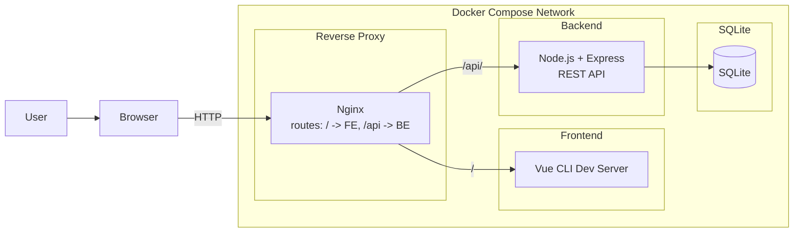

```mermaid
flowchart LR
  U[User] --> B[Browser]

  subgraph DC[Docker Compose Network]
    subgraph RP[Reverse Proxy]
      NG[Nginx<br/>routes: / -> FE, /api -> BE]
    end

    subgraph FE[Frontend]
      VUE[Vue CLI Dev Server]
    end

    subgraph BE[Backend]
      API[Node.js + Express<br/>REST API]
    end

    subgraph DB[SQLite]
      SQLF[(SQLite)]
    end

    API --> SQLF
    NG -->|/| VUE
    NG -->|/api/| API
  end

  B -->|HTTP| NG
```